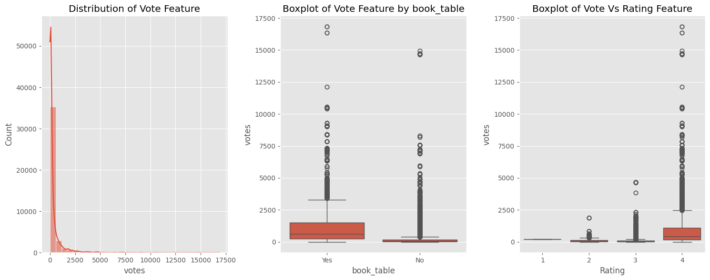
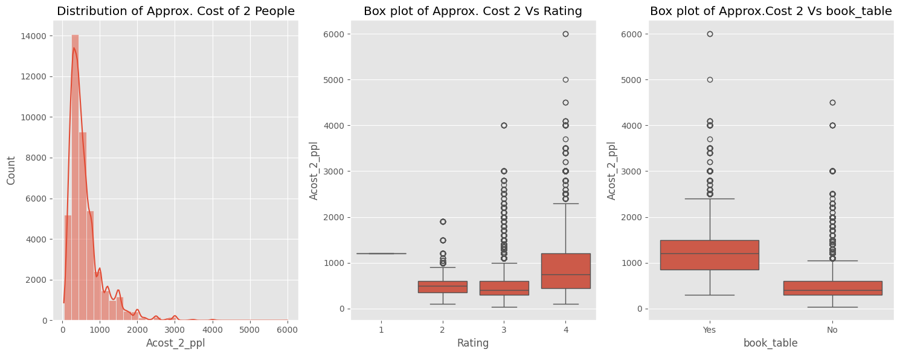
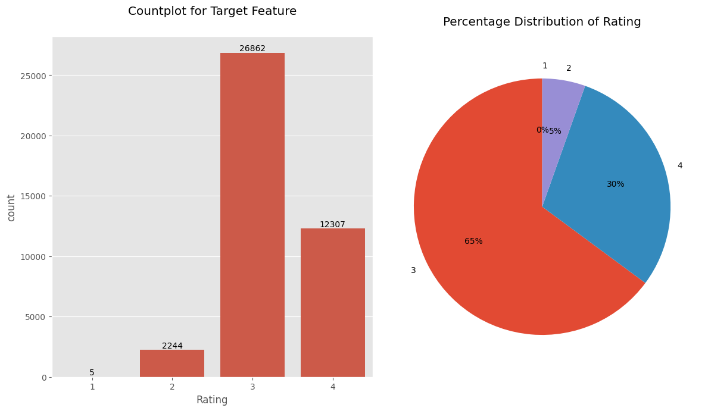
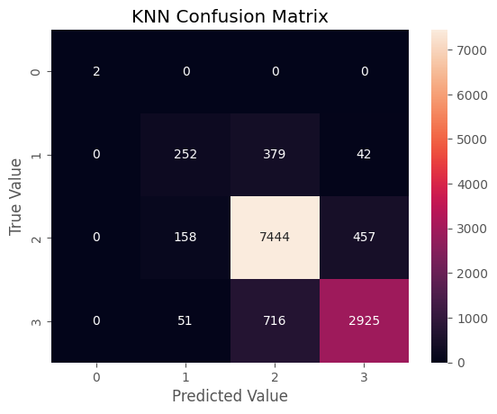
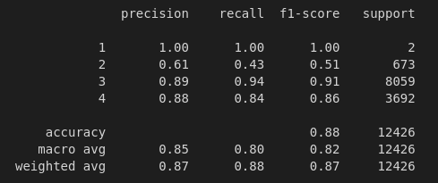

<h1 align="center">Zomato Rating Class Prediction</h1>

## Background ❓

In the age of digitalization, online platforms have become essential for users to explore and select dining options. Restaurant ratings play a crucial role in helping users make informed decisions about where to dine. These ratings can have huge ramifications on the restaurant business. Therefore, developing an automated system that is able to accurately predicting restaurant ratings based on various features can significantly improve both customer and business experoience as businesses.

## Objective 🎯
The objective of this project is to develop a machine learning model that accurately predicts restaurant ratings based on a set of features. Specifically, the model will perform multi-class classification to assign restaurants into predefined rating classes, such "Class 1" = 0 to 1.9, Class 2 = 2 to 2.9, Class 3 = 3 to 3.9, Class 4 = 4 to 5.

## Solution 💡

Our process will start with Exploratory Data Analysis (EDA) with a goal to gain better insight about our data set and eventually develop a model using machine learning methodology. I will be deploying Ensmeble learning techniques like stacking and blending that might help improve model performance.

## 1. Exploratory Data Analysis 💾

I have acquired the dataset, the next step involves conducting Exploratory Data Analysis (EDA) to glean insights and refine the dataset in preparation for modeling endeavors.

**1.1 Dataset**

**Zomato.csv** dataset represents real-world Zomato ratings for restaurants in Bangalore, encompassing ratings for approximately 51,717 restaurants across 17 distinct features. Among these features, one stands out as the target variable: the rating assigned to each restaurant. This data is accurate to that available on the zomato website until 15 March 2019.

**1.2 Initial Observation**

- The dataset contains 1296675 observation
- The Data set contains a total of 361,199 null values. The target feature "rate" has 7775 null values while "dish_liked" has the most null value 28078  
- The dataset contains a total of 17 columns out of which we have a single dependent variable labeled "rate"
- Out of these 17 columns 'url','address','name','phone','reviews_list','menu_item','listed_in(city)','rest_type','location','cuisines' were dropped for various reasons   
- The 'rate' feature is an object type data that contains values of rating in the format "4.1/5" which must be cleaned and converetd into teh 4 duffrent classes as thsi is a multiclass classification problem
- Nominal Features such as "online_order" ,"book_table" need to be encoded using one hot encoding
- The data has a lot of noise that must be cleaned 

**1.3 Feature Engineering and Data Cleaning**

- Null values were dealt with by sperating the observations with null values into a different .csv file for Inferencing data
- This sepeartion was done before major feature engineering to avoid **data leakage**   
- "Rate" Featured was renamed to "Rating" and cleaned and type cast as categorical data type with values "1","2"."3","4"
- Rare features of "listed_in(type)" were grouped
- One hot encoding was applied to "online_order", "book_table"

**1.4 Univariate, Bivariate and Multivariate Analysis**

**1.4.1. Online Order Distribution**

The following diagram shows the Countplot, percentage distribution of Online_Order in the dataset and we can observe that the data is imbalanced but it is acceptable for our purpose. Furthermore, the figure also contains a countplot of "rating" grouped by "Online_Order".

**Figure 1.** Distribution of Online_order

**1.4.2. Book Table Distribution**

The following diagram shows the Countplot, percentage distribution of Book_table in the dataset and we can observe that the data is highly imbalanced. Furthermore, the figure also contains a countplot of "rating" grouped by "Book_table".

**Figure 2.** Distribution of Book_table

**1.4.3. Vote Distribution**

The following diagram shows the distribution of "vote" feature and also shows the boxplot with the vote feature versus rating and book_tabel feature to check for significant impact on the mean and for outliers for the given rating class as well as book_table feature. 

**Figure 3.** Distribution of Book_table

**1.4.4. Approx cost for 2 People Distribution**

The following diagram shows the distribution of "approx_cost(for two people)" feature and also shows the boxplot with the approximate cost feature versus rating and book_tabel feature to check for significant impact on the mean and for outliers for the given rating class as well as book_table feature. 

**Figure 4.** Distribution of Approx cost for 2 People

**1.4.5. List_in(type) Distribution**

The following diagram shows the Countplot, percentage distribution of list_in(type) in the dataset and the figure also contains a countplot of "rating" grouped by "list_in(type)".

**Figure 5.** Distribution of List_in(type)

**1.4.6. Rating Feature Distribution**

The following diagram shows the Countplot and the percentage distribution of Rating which is our target featuer.We can see clearly that there is a high levle of imbalance between our features.

**Figure 6.** Rating Feature Distribution

**1.4.7. Correlation Analysis**

The following diagram shows the correlation between all of our features 

**Figure 7.** Correlation Heatmap

**1.5. EDA Observation**
- In Banglore 65.7% of restaurants are accepts online orders and 34.3% of the restaurants do not accept online orders
- 84.8% restaurants in Banglore do not provide table booking facility.
- Over 90 percent of the restaurant falls in class 3 and 4 i.e. 3-5 rating score
- In bangalore almost 90% of restaurants serve food for budget less than 1000 INR
- The Restaurants offering tabel booking service tend to get more votes from customers
- The mean value for Approximate cost of 2 people goes above 1000 for resturents that offer table booking service
- Table booking service has the highest correlation with our target feature.

## 2. Approach 🤖

I prepare the data from the EDA for machine learning model development by creating a train and test split by 70% and 30% respectively. In this phase we stratify the data so that the train and the test split have equal proportions of all four classes of our dependent variable. We do this to improve the models performance as the data that we have is heavily imbalanced. 

**2.1 Machine Learning Approach**

In this approach, we use six different machine learning algorithms and use stacking and blending techniques:

- Decision Tree Model
- Random Forest Model
- CatBoosting Model
- Pycaret
- K-Nearest Neighbors Classifier Model
- Stacking using Decision Tree Model, Random Forest Model, K-Nearest Neighbors Classifier as the base model and then traing the meta model using Random Forest Classifier
- Blending using Decision Tree Model, Random Forest Model, K-Nearest Neighbors Classifier as the base model and then traing the meta model using Extra Tree Classifier   

**2.1.1. Decision Tree Model**

**Metrics Explained**

Term Explanation

- **Precision**: The proportion of correctly identified instances among those labeled as positive. It measures how often the model is correct when it predicts a positive result.
- **Recall**: The proportion of actual positive instances that were correctly identified. It measures how often the model correctly identifies all positive cases.
- **F1-score**: The harmonic mean of precision and recall, providing a balanced measure of accuracy that considers both. Higher F1-scores indicate better overall performance.
- **Support**: The number of instances for each class in the dataset. It shows how much data was available for training and evaluation.

**Results & Metrics :** The following diagram shows the confusion matrix and classification report with precision, recall, and F1-score.

**Figure 8.** Classification Report for Decision Tree

**2.1.2. Random Forest Model**

**Results & Metrics :** The following diagram shows the confusion matrix and classification report with precision, recall, and F1-score.

**Figure 9.** Classification Report for Random Forest Model   

**2.1.3. CatBoosting Model**

**Results & Metrics :** The following diagram shows the confusion matrix and classification report with precision, recall, and F1-score.

**Figure 10.** Classification Report for CatBoosting Model   

**2.1.4. Pycaret**

When we apply Pycaret to find the best fit model we can see that the Extra Tree Classifier has a slightly better performance when we look at the produced F1 score. So we will be using extra tree classifier as our meta model during blending.

**Figure 11.** Pycaret best fit model

**2.1.5. K-Nearest Neighbors Classifier Model**

**Results & Metrics :** The following diagram shows the confusion matrix and classification report with precision, recall, and F1-score.

**Figure 12.** Classification Report for K-Nearest Neighbors Classifier Model   

**2.1.6. Stacked Random Forest Classifier Model**

**Results & Metrics :** The following diagram shows the confusion matrix and classification report with precision, recall, and F1-score.

**Figure 13.** Classification Report for Stacked Random Classifier Model   

**2.1.7. Blended Extra Tree Classifier Model**

**Results & Metrics :** The following diagram shows the confusion matrix and classification report with precision, recall, and F1-score.

**Figure 13.** Classification Report for Blended Extra Tree Classifier Model   

## Conclusion 📢

As expected due to the imbalanced dataset all the models show slightly worst performance when predicting class 1 and class 2 however class 3 and class 4 have a good level of performance with regards to their precision, recall and F1 score. Deccision Tree, Random Forest, Stacking and Blending seem to acomplish acceptable results with data limitation that existed.  

   
